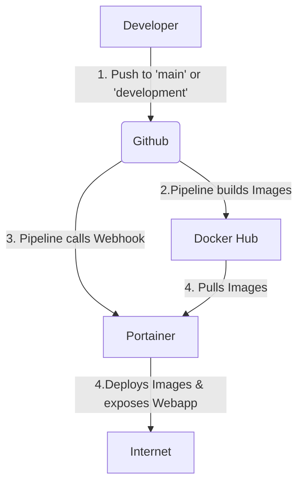

---
# try also 'default' to start simple

theme: default

# random image from a curated Unsplash collection by Anthony

# like them? see https://unsplash.com/collections/94734566/slidev

background: /AdobeStock_308681961.jpeg

# apply any windi css classes to the current slide

class: 'text-center'

# https://sli.dev/custom/highlighters.html

highlighter: shiki
lineNumbers: true

favicon: 'https://rvgs.ch/favicon.ico'

# some information about the slides, markdown enabled

info: Presentation for IP5 Project

# persist drawings in exports and build

# use UnoCSS

css: unocss

fonts:
    # basically the text
    sans: 'Robot'
    # use with `font-serif` css class from windicss
    serif: 'Robot Slab'
    # for code blocks, inline code, etc.
    mono: 'Fira Code'

---

# CEEX – Clean Energy Exchange

## IP5 22HS_IIT21

Raphael Lüthy & George Rowlands

---
layout: image-right

image: https://external-content.duckduckgo.com/iu/?u=https%3A%2F%2Fwallpapercave.com%2Fwp%2Fwp4241384.jpg&f=1&nofb=1&ipt=223fe6f6ace4f0bdf6722d165d16da905c8c8f543c0b137e4f92fc1e3a33f059&ipo=images
---
# Table of contents

- Who are we?
- What is CEEX
- Initial State
- Problems and their Solutions
- Learnings
- Future Work
- QnA

---
layout: two-cols-header
---
# Who Are We?

::left::

## George Rowlands


::right::

## Raphael Lüthy


---
layout: default
---

# What is CEEX?

- Swiss startup working with 3 universities
- Supported by InnoSuisse
- Trade sustainably produced energy as a community


---
layout: default
---

# What is CEEX?

- Centralized to decentralized market
- Results in an open and self-regulated market
- Competitive and stable market


---
layout: fact
---

# Initial State

---
layout: two-cols-header
---

# Initial State

::left::

## Code Base

- Static Components
- Static Values

```html
<mat-option value="o1">current Week</mat-option>
<mat-option value="o2">current Month</mat-option>
<mat-option value="o3">last Month</mat-option>
<mat-option value="o4">last 3 Month</mat-option>
<mat-option value="o4">last Year</mat-option>
```

```ts
export class DataService {
    baseurl = 'http://127.0.0.1:8000/';
    resetUrl = this.baseurl + 
        'auth/request-reset-email/';
...
}
```

::right::

## Deployment & Architecture

- Server
- Pipeline
- SSL / Reverse Proxy

<div class="text-center">

</div>

---

# Initial State

## Static Components

```html {all|6,9,13,15}

<mat-card class="list-element">
    
    <div class="list-element__info ">
        <div class="horizontal_info">
            <h2>Max Mustermann</h2>
            
        </div>
        <span id="amount">200kWh</span>
        <div class="horizontal_info last_row ">
            <div>
                
                <span id="distance">300m</span>
            </div>
            <span id="horizontal_info">0.18 CHF / kWh</span>
        </div>
    </div>
</mat-card>
```
---

# Initial State
# Static


```ts {all|2|all}
export class DataService {
    baseurl = 'http://127.0.0.1:8000/';
    resetUrl = this.baseurl + 'auth/request-reset-email/';
...
}
```
<p></p>

<v-click>

## Issues

</v-click>

<v-clicks>

- Maintainability
  - -> Hard to keep track where to change values
- Reusability
  - -> Can't be reused if different values are needed
- Deployability
  - -> Deployments need to change values at runtime

</v-clicks>

---
layout: image-right

# the image source
image: https://cdn.dribbble.com/users/453325/screenshots/5573953/empty_state.png
---

# Initial State
## Containerization, Pipeline and Deployment
- No Containerization
- No Pipeline
- No Server


::right::

---
layout: two-cols-header
---

# Initial State
## Architecture

::left::

<p/>

- What Side does what?
- Who owns which data?
- How does the communication between Customer and Business Logic work?
- Who owns the Authentication?

::right::


---
layout: two-cols-header
---

# Initial State
## Usability

::left::

<p/>

<v-click>

- A lot of different fields
- Functionalities with insufficient titles
- No clear distinction of importance
- No clear indication of what interactive

</v-click>

<v-click>

<p class="text-3xl text-red-300">-> Items need more explanation</p>

</v-click>

::right::


---
layout: fact
---

# Solutions

---
layout: fact
---

# Dynamic Data & Functionality

---
layout: two-cols-header
---

# Dynamic Data & Functionality

- Static data replaced with dynamically fetched data
- Refactored and abstracted code for reusability

::left::

## Before

```jsx{6|2,8,11}
...
        <span id="amount">200kWh</span>
        <div class="horizontal_info last_row ">
            <div>
                
                <span id="distance">300m</span>
            </div>
            <span id="horizontal_info">
                0.18 CHF / kWh
            </span>
        </div>
...
```

::right::

## After

```jsx{none|all}
 <supplier-card
        *ngFor="let supplier of supplierList"
        [supplier]="supplier" 
 />
```

```jsx{3,5|8,11,12}
...
<div class="supplier-distance">
    <mat-icon 
        class="distance-icon" 
        svgIcon="home_pin_icon"
    />
    <span class="distance-info">
        {{ supplier?.distance }} km
    </span>
</div>
<span>{{ supplier?.amount }} kWh</span>
<span>{{ supplier?.price }} / kWh</span>
...
```

---
layout: fact
---

# Deployment & Containerization

---

# Deployment & Containerization
## Server setup


---
layout: two-cols-header
---

# Deployment & Containerization
## Server setup

::right::


::left::
Steps to take:

- Dockerfiles (Containerize Application)
- Server
- Reverse Proxy (traefik)
- Portainer
- Pipeline

---
layout: two-cols-header
---

# Deployment & Containerization
## Dockerfiles

::left::

Frontend:
```docker {all|4,11}
FROM node:14-alpine as build
WORKDIR /app
RUN npm install -g @angular/cli@13.3.10
RUN npm install -g serve@14.1.2
COPY ./frontend/package.json ./
RUN npm install --force
COPY ./frontend .
RUN ng build --configuration=production 
  --output-path=dist
EXPOSE 3000
CMD ["serve", "./dist", "-p", "3000"]
```


::right::

Backend:

```docker {all}
FROM python:3.10-alpine3.15
  # stops stdout and stderr streams being buffered
ENV PYTHONUNBUFFERED 1
WORKDIR /app/backend
COPY backend/requirements.txt /app/backend/
RUN ["pip", "install", "-r", "requirements.txt"]
COPY backend/ceex_api /app/backend/
EXPOSE 8000
```

---
layout: two-cols-header
---

# Deployment & Containerization
## Server

::left::

Actual Server:


<a class="text-coolgray absolute mt-25 text-sm" href="https://www.switch.ch/engines/">Switch Engines Website</a>

::right::

Reverse Proxy:


<a class="text-coolgray text-sm" href="https://doc.traefik.io/traefik/">Traefik Documentation</a>

---
layout: two-cols-header
---

# Deployment & Containerization
## Portainer

::left::

<p/>

- Control of Images / Containers
- Redeployment of latest Image via Webhook
- Stacks

::right::


---
layout: two-cols-header
---

# Deployment & Containerization
## Portainer: "Stack"

::left::

<p/>

- Specifies Docker Images
- Connect the backend to the database
- Expose UI and API to Reverse Proxy

::right::

```yaml {all|4,8|5,6,9,10,11,13-19}
version: '3.9'
services:
    ui:
        image: 'raphaelluethy/ceex:ui-prod-latest'
        networks:
          - proxy
    api:
        image: 'raphaelluethy/ceex:api-prod-latest'
        networks:
            - proxy
            - database

networks:
    proxy:
        name: 'proxy'
        external: true
    database:
        name: 'database'
        external: true
```

---
layout: two-cols
---

# Deployment & Containerization
## Pipeline

1. Push to Branch "main" (production) or "development" (staging)
2. Spin up Ubuntu VM
3. Checkout the Source Code
4. Login to Docker Hub
5. Build the Docker Image
6. Push the Docker Image to Docker Hub
7. Call Webhook of Portainer
8. Cleanup

::right::

```yaml {all|1-4|5-8|9,10|11-15|16-18|19-21|22-26|27}
on:
  push:
    branches:
      - main
jobs:
  build_push_containers:
    runs-on: ubuntu-latest
    steps:
      - name: Checkout
        uses: actions/checkout@v2
      - name: Login docker
        uses: docker/login-action@v1
        with:
          username: ${{ secrets.DOCKER_USERNAME }}
          password: ${{ secrets.DOCKER_PASSWORD }}
      - name: Build Docker image
        run: docker compose -f 
          docker-compose.prod.yml build
      - name: Push Docker image
        run: docker compose -f 
          docker-compose.prod.yml push
      - name: Call webhook
        uses: satak/webrequest-action@master 
        with:
          url: ${{ secrets.WEBHOOK_PROD_URL }}
          method: POST
      Here comes cleanup...
```

---
layout: two-cols-header
---

# Architecture

::left::

Original Problems:

- What Side does what?
- Who owns which data?
- How does the communication between Customer and Business Logic work?
- Who owns the Authentication?

::right::


---
layout: two-cols-header
---

# Architecture
## Data Agreement

::left::
Webapp:
- Own Authentication Layer
- Stores what user belongs to which _**Node**_
- Provides Proxy for user to communicate with Business Logic

Business Logic:
- Home of the Algorithm
- Stores all the data related to trading

<p class="text-sm">Node: Maps the actual household to the graph of the algorithm</p>

::right::


---
layout: two-cols-header
---

# Proxy

::right::


::left::
Frontend:
```ts
return this.http.post(`${this.proxyBaseUrl}`, {
    url: `node/${nodeId}/
            metrics?startDate=${startDateTime}
            &endDate=${endDateTime}`,
    method: 'GET',
});
```
Backend:
```py
response = requests.request(
    method=method,
    url=f'{remote_url}{request_url}',
    allow_redirects=False
    )

return JsonResponse(response.json(), safe=False)
```
---
layout: fact
---

# Usability

---
layout: two-cols-header
---

# Usability

## Design

- Consistent colors, fonts and spacing
- Restructured components for a better workflow

::left::

Old:


::right::
New:


---
layout: two-cols-header
---

# Usability

## Design

- Highlighted key features
<br/>
<br/>

::left::

Old:


::right::
New:


---
layout: two-cols-header
---

# Usability

## SASS Usage

- Set global styles
- Used SASS features like: Variables, Mixins etc.

::left::

Before:
```sass
.supplier-info {
    // common pattern
    display: flex;
    flex-direction: column;
    justify-content: flex-start;
    align-items: stretch;
    // font styles
    ...
    // other styles
    ...
}
```

::right::
After:
```sass
// Can be reused 
@mixin col($content: flex-start, $items: stretch) {
  display: flex;
  flex-direction: column;
  justify-content: $content;
  align-items: $items;
}

.supplier-info {
    @include col(space-evenly);
    @extend .card-title;
    width: 100%;
    padding: 0rem;
}
```

---
layout: two-cols-header
---

# Usability

## Internationalization

::left::

- More accessible for users
- Broadens customer pool 
- Currently supported languages: English, German, French


::right::


---
layout: two-cols-header
---

# Usability

::left::

## Tooltips

- Convey additional information to users
- Hidden to avoid filling the screen


::right::


---
layout: two-cols-header
---

# Usability

## Dialog Windows

::left::

- Tooltip not always enough
- Used for:
  - Additional Information
  - Forms


::right::


---
layout: fact
---

# Future Work

---
layout: two-cols-header
---

# Future Work

::left::

- Find new library for map
  - OpenLayers or Leaflet
- Italian language
- Integrate HSLU data API
- Improve registration process
  - Address validation with Google API
  - Geolocation from validated address
  - Automatic information extraction from bill image

::right::


---
layout: fact
---

# Learnings


---
layout: two-cols-header
---

# Learnings

::left::

- New technologies and frameworks
- Communicating and coordinating a distributed team
  - Dos and don'ts
  - Future improvements
- How IP6 will work

::right::


---
layout: fact
---

# Thank you for listening 🎉

---
layout: fact
---

# Any Questions? 🔎

