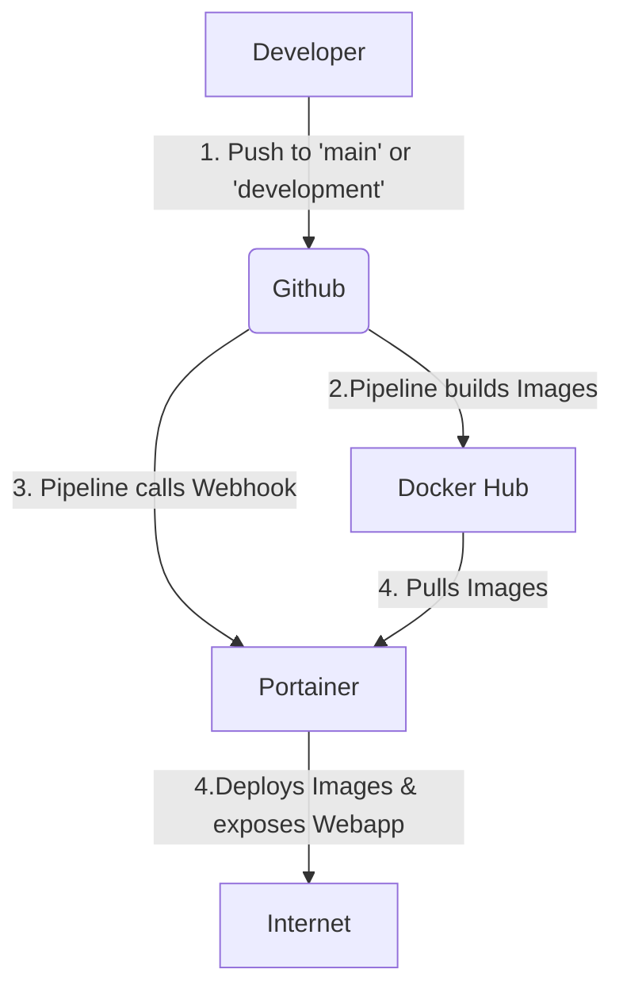
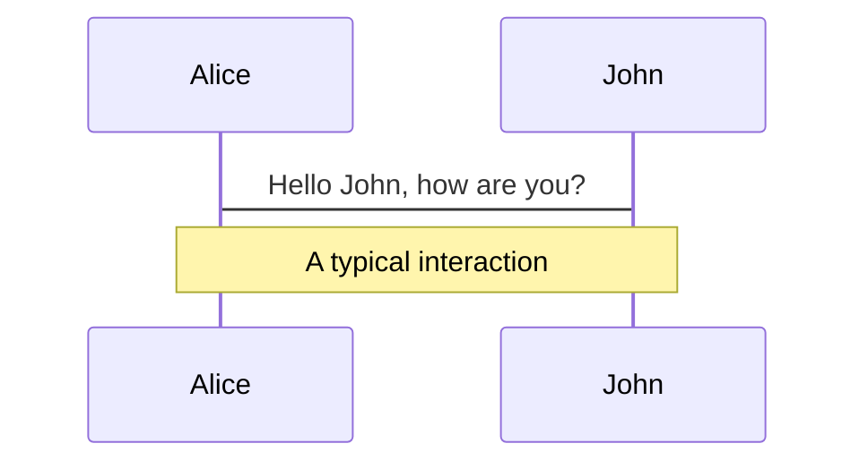
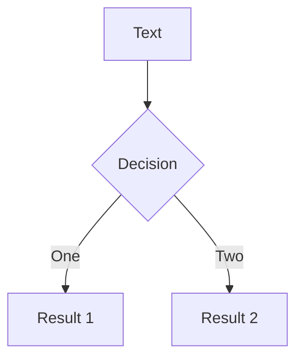
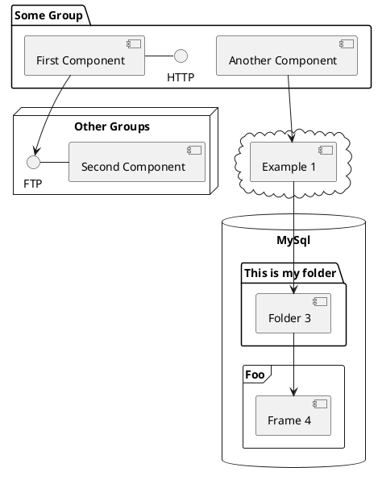

---
# try also 'default' to start simple

theme: default

# random image from a curated Unsplash collection by Anthony

# like them? see https://unsplash.com/collections/94734566/slidev

background: /AdobeStock_308681961.jpeg

# apply any windi css classes to the current slide

class: 'text-center'

# https://sli.dev/custom/highlighters.html

highlighter: shiki
lineNumbers: true

# some information about the slides, markdown enabled

info: Presentation for IP5 Project

# persist drawings in exports and build

# use UnoCSS

css: unocss

fonts:
    # basically the text
    sans: 'Robot'
    # use with `font-serif` css class from windicss
    serif: 'Robot Slab'
    # for code blocks, inline code, etc.
    mono: 'Fira Code'

---

# CEEX – Clean Energy Exchange

## IP5 22HS_IIT21

Raphael Lüthy & George Rowlands

---

# Table of contents

- Who are we?
- What is CEEX
- Initial State
- Problem and its Solution
- Learnings
- Future Work
- QnA

---

# Who are we

Raphi & Groog

---

# What is CEEX

---
layout: fact
---

# Initial State

---
layout: two-cols-header
---

# Initial State

::left::

## Code Base

- Hard Coded Components
- Hard Coded Values

```html

<mat-option value="option1">current Week</mat-option>
<mat-option value="option2">current Month</mat-option>
<mat-option value="option3">last Month</mat-option>
<mat-option value="option4">last 3 Month</mat-option>
<mat-option value="option4">last Year</mat-option>
```

```ts
export class DataService {
    baseurl = 'http://127.0.0.1:8000/';
    resetUrl = this.baseurl + 'auth/request-reset-email/';
...
}
```

::right::

## Deployment & Architecture

- Server
- Pipeline
- SSL / Reverse Proxy

<div class="text-center">

</div>

---

# Initial State

## Hard Coded Components

```html {all|6,9,13,15}

<mat-card class="list-element">
    
    <div class="list-element__info ">
        <div class="horizontal_info">
            <h2>Max Mustermann</h2>
            
        </div>
        <span id="amount">200kWh</span>
        <div class="horizontal_info last_row ">
            <div>
                
                <span id="distance">300m</span>
            </div>
            <span id="horizontal_info">0.18 CHF / kWh</span>
        </div>
    </div>
</mat-card>
```
---

# Initial State
# Hard Coded


```ts {all|2|all}
export class DataService {
    baseurl = 'http://127.0.0.1:8000/';
    resetUrl = this.baseurl + 'auth/request-reset-email/';
...
}
```
<p></p>

<v-click>

## Issues

</v-click>

<v-clicks>

- Maintainability
  - -> Hard to keep track where to change values
- Reusability
  - -> Can't be reused if different values are needed
- Deployability
  - -> Deployments need to change values at runtime

</v-clicks>

---
layout: image-right

# the image source
image: https://wallpapercave.com/wp/wp7848331.png
---

# Initial State
## Containerization, Pipeline and Deployment
- No Containerization
- No Pipeline
- No Server


::right::


---
layout: two-cols-header
---

# Initial State
## Architecture

::left::

<p/>

- What Side does what?
- Who owns which data?
- How does the communication between Customer and Business Logic work?
- Who owns the Authentication?

::right::


---
layout: two-cols-header
---

# Initial State
## Usability

::left::

<p/>

<v-click>

- A lot of different fields
- Functionalities with insufficient titles
- No clear distinction of importance
- No clear indication of what interactive

</v-click>

<v-click>

<p class="text-3xl text-red-300">-> Items need more explanation</p>

</v-click>

::right::


---
layout: fact
---

# Solutions

---
layout: fact
---

# Deployment & Containerization

---

# Deployment & Containerization
## Server setup


---
layout: two-cols-header
---

# Deployment & Containerization
## Server setup

::right::


::left::
Steps to take:

- Dockerfiles (Containerize Application)
- Server
- Reverse Proxy (traefik)
- Portainer
- Pipeline

---
layout: two-cols-header
---

# Deployment & Containerization
## Dockerfiles

::left::

Frontend:
```yaml {all|4,11}
FROM node:14-alpine as build
WORKDIR /app
RUN npm install -g @angular/cli@13.3.10
RUN npm install -g serve@14.1.2
COPY ./frontend/package.json ./
RUN npm install --force
COPY ./frontend .
RUN ng build --configuration=production 
  --output-path=dist
EXPOSE 3000
CMD ["serve", "./dist", "-p", "3000"]
```


::right::

Backend:

```yaml {all}
FROM python:3.10-alpine3.15
  # stops stdout and stderr streams being buffered
ENV PYTHONUNBUFFERED 1
WORKDIR /app/backend
COPY backend/requirements.txt /app/backend/
RUN ["pip", "install", "-r", "requirements.txt"]
COPY backend/ceex_api /app/backend/
EXPOSE 8000
```

---
layout: two-cols-header
---

# Deployment & Containerization
## Server

::left::

Actual Server:


<a class="text-coolgray absolute mt-25 text-sm" href="https://www.switch.ch/engines/">Switch Engines Website</a>

::right::

Reverse Proxy:


<a class="text-coolgray text-sm" href="https://doc.traefik.io/traefik/">Traefik Documentation</a>

---
layout: two-cols-header
---

# Deployment & Containerization
## Portainer

::left::

<p/>

- Control of Images / Containers
- Redeployment of latest Image via Webhook
- Stacks

::right::


---
layout: two-cols-header
---

# Deployment & Containerization
## Portainer: "Stack"

::left::

<p/>

- Specifies Docker Images
- Connect the backend to the database
- Expose UI and API to Reverse Proxy

::right::

```yaml {all|4,8|5,6,9,10,11,13-19}
version: '3.9'
services:
    ui:
        image: 'raphaelluethy/ceex:ui-prod-latest'
        networks:
          - proxy
    api:
        image: 'raphaelluethy/ceex:api-prod-latest'
        networks:
            - proxy
            - database

networks:
    proxy:
        name: 'proxy'
        external: true
    database:
        name: 'database'
        external: true
```

---

# Architecture

---

# Data Agreement

---

# Proxy

---

# What is Slidev?

Slidev is a slides maker and presenter designed for developers, consist of the following features

- 📝 **Text-based** - focus on the content with Markdown, and then style them later
- 🎨 **Themable** - theme can be shared and used with npm packages
- 🧑‍💻 **Developer Friendly** - code highlighting, live coding with autocompletion
- 🤹 **Interactive** - embedding Vue components to enhance your expressions
- 🎥 **Recording** - built-in recording and camera view
- 📤 **Portable** - export into PDF, PNGs, or even a hostable SPA
- 🛠 **Hackable** - anything possible on a webpage

<br>
<br>

Read more about [Why Slidev?](https://sli.dev/guide/why)

<!--
You can have `style` tag in markdown to override the style for the current page.
Learn more: https://sli.dev/guide/syntax#embedded-styles
-->

<style>
h1 {
  background-color: #2B90B6;
  background-image: linear-gradient(45deg, #4EC5D4 10%, #146b8c 20%);
  background-size: 100%;
  -webkit-background-clip: text;
  -moz-background-clip: text;
  -webkit-text-fill-color: transparent;
  -moz-text-fill-color: transparent;
}
</style>

<!--
Here is another comment.
-->

---

# Navigation

Hover on the bottom-left corner to see the navigation's controls
panel, [learn more](https://sli.dev/guide/navigation.html)

### Keyboard Shortcuts

|                                                     |                             |
|-----------------------------------------------------|-----------------------------|
| <kbd>right</kbd> / <kbd>space</kbd>                 | next animation or slide     |
| <kbd>left</kbd>  / <kbd>shift</kbd><kbd>space</kbd> | previous animation or slide |
| <kbd>up</kbd>                                       | previous slide              |
| <kbd>down</kbd>                                     | next slide                  |

<!-- https://sli.dev/guide/animations.html#click-animations -->

<p v-after class="absolute bottom-23 left-45 opacity-30 transform -rotate-10">Here!</p>

---
layout: image-right
image: https://source.unsplash.com/collection/94734566/1920x1080
---

# Code

Use code snippets and get the highlighting directly![^1]

```ts {all|2|1-6|9|all}
interface User {
    id: number
    firstName: string
    lastName: string
    role: string
}

function updateUser(id: number, update: User) {
    const user = getUser(id)
    const newUser = {...user, ...update}
    saveUser(id, newUser)
}
```

<arrow v-click="3" x1="400" y1="420" x2="230" y2="330" color="#564" width="3" arrowSize="1" />

[^1]: [Learn More](https://sli.dev/guide/syntax.html#line-highlighting)

<style>
.footnotes-sep {
  @apply mt-20 opacity-10;
}
.footnotes {
  @apply text-sm opacity-75;
}
.footnote-backref {
  display: none;
}
</style>

---

# Components

<div grid="~ cols-2 gap-4">
<div>

You can use Vue components directly inside your slides.

We have provided a few built-in components like `<Tweet/>` and `<Youtube/>` that you can use directly. And adding your
custom components is also super easy.

```html

<Counter :count="10"/>
```

<!-- ./components/Counter.vue -->
<Counter :count="10" m="t-4" />

Check out [the guides](https://sli.dev/builtin/components.html) for more.

</div>
<div>

```html

<Tweet id="1390115482657726468"/>
```

<Tweet id="1390115482657726468" scale="0.65" />

</div>
</div>

<!--
Presenter note with **bold**, *italic*, and ~~striked~~ text.

Also, HTML elements are valid:
<div class="flex w-full">
  <span style="flex-grow: 1;">Left content</span>
  <span>Right content</span>
</div>
-->


---
class: px-20
---

# Themes

Slidev comes with powerful theming support. Themes can provide styles, layouts, components, or even configurations for
tools. Switching between themes by just **one edit** in your frontmatter:

<div grid="~ cols-2 gap-2" m="-t-2">

```yaml
---
theme: default
---
```

```yaml
---
theme: seriph
---
```


</div>

Read more about [How to use a theme](https://sli.dev/themes/use.html) and
check out the [Awesome Themes Gallery](https://sli.dev/themes/gallery.html).

---
preload: false
---

# Animations

Animations are powered by [@vueuse/motion](https://motion.vueuse.org/).

```html

<div
        v-motion
        :initial="{ x: -80 }"
        :enter="{ x: 0 }">
    Slidev
</div>
```

<div class="w-60 relative mt-6">
  <div class="relative w-40 h-40">
    
    
    
  </div>

  <div
    class="text-5xl absolute top-14 left-40 text-[#2B90B6] -z-1"
    v-motion
    :initial="{ x: -80, opacity: 0}"
    :enter="{ x: 0, opacity: 1, transition: { delay: 2000, duration: 1000 } }">
    Slidev
  </div>
</div>

<!-- vue script setup scripts can be directly used in markdown, and will only affects current page -->
<script setup lang="ts">
const final = {
  x: 0,
  y: 0,
  rotate: 0,
  scale: 1,
  transition: {
    type: 'spring',
    damping: 10,
    stiffness: 20,
    mass: 2
  }
}
</script>

<div
  v-motion
  :initial="{ x:35, y: 40, opacity: 0}"
  :enter="{ y: 0, opacity: 1, transition: { delay: 3500 } }">

[Learn More](https://sli.dev/guide/animations.html#motion)

</div>

---

# LaTeX

LaTeX is supported out-of-box powered by [KaTeX](https://katex.org/).

<br>

Inline $\sqrt{3x-1}+(1+x)^2$

Block
$$
\begin{array}{c}

\nabla \times \vec{\mathbf{B}} -\, \frac1c\, \frac{\partial\vec{\mathbf{E}}}{\partial t} &
= \frac{4\pi}{c}\vec{\mathbf{j}} \nabla \cdot \vec{\mathbf{E}} & = 4 \pi \rho \\

\nabla \times \vec{\mathbf{E}}\, +\, \frac1c\, \frac{\partial\vec{\mathbf{B}}}{\partial t} & = \vec{\mathbf{0}} \\

\nabla \cdot \vec{\mathbf{B}} & = 0

\end{array}
$$

<br>

[Learn more](https://sli.dev/guide/syntax#latex)

---

# Diagrams

You can create diagrams / graphs from textual descriptions, directly in your Markdown.

<div class="grid grid-cols-3 gap-10 pt-4 -mb-6">







</div>

[Learn More](https://sli.dev/guide/syntax.html#diagrams)

---
src: ./pages/multiple-entries.md
hide: false
---

---
layout: center
class: text-center
---

# Learn More

[Documentations](https://sli.dev) · [GitHub](https://github.com/slidevjs/slidev) · [Showcases](https://sli.dev/showcases.html)
